# 3D打印直流无刷电机

标签： Arduino 3D打印  直流无刷电机

--- 
>[原文链接](http://makezine.com/projects/make-38-cameras-and-av/raspberry-pirate-radio/) 作者: pitrack  翻译:plantpark

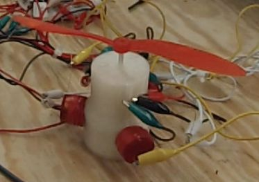

我设计并使用3D打印机制造了一个无刷直流电机（BLDC），并且使用Arduino去控制这个电机。电机的所有组成部分，包括永磁体，磁极线圈，霍尔效应传感器，都由Makerbot Replicator 2制造。视频展示了完成后电机工作的情形。
##步骤一：材料和工具

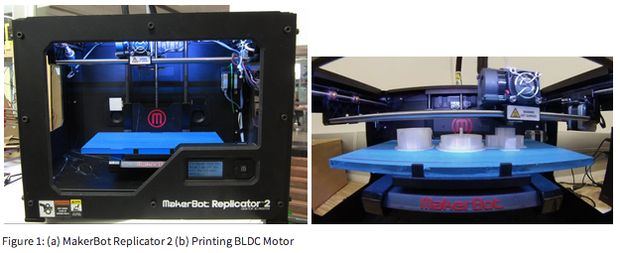
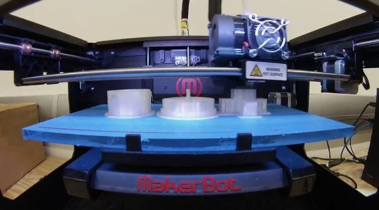

本项目需要一个3D打印机，一个arduino控制板，一些基本的电子制作工具，例如万用表、示波器、电源和一些电子元器件。以下是我使用的材料和工具的完整清单。
工具：

* Makerbot Replicator2 3D打印机
* CAD软件—Google SketchUP—MakerWare
* 绕线机
* 万用表
* 示波器

机械部分：

* PLA塑料
* 约100m 26AWG漆包线用于绕制线圈
* 8个N48圆形钕磁体，尺寸为1/2乘1/8英寸

电子配件：

* Arduino Uno 面包板及连线
* 小鳄鱼嘴夹子
* 12V电池供电-8AA电池串联

元器件：

* L6234 3相电机驱动IC
* 3个SS411A霍尔场效应传感器
* 电阻
  * 3X 120kOhm
  * 6X ~400Ohm
  * 1Ohm
  * 100 kOhm Potentiometer
* 电容
  * 100uF
  * 330nF
  * 100nF
  * 10nF
  * 2X 二极管
  
表格一列出了制作本项目的花费。诸如电阻电容等与总花费相比十分便宜的电子元器件没有计入总花费中。不包括Arduino控制板和电池的总花费在$27.71美元。需要说明的是缩减项目花费没有被列为很高的优先级，所以经过优化组合后可以进一步降低本项目的成本。
##步骤二：电机设计

无刷直流电机的设计是建立在以下原则基础之上的，电机应该易于由已经可用的部件组装而成，并且应该达到和许多商用直流电机相似的性能，例如驱动小型电风扇。
电机被设计成3相4极无刷直流电机，它使用4对N52钕磁体作为转子磁极，定子采用3组线圈绕线而成。选择使用无刷直流电机的原因是其高效率、机械结构部件较少和较小的摩擦力。选择N52永磁体的原因是其磁力、价格和易用性。无刷直流电机的控制将在‘无刷直流电机控制’部分进一步讨论。表格2对无刷和有刷直流电机进行了比较。
定子磁极线圈由8~12V电压驱动并由电子换相电路控制。3个霍尔效应传感器提供了转子的位置信息用于电子换相电路的切换。
以下方程用于估算电机的性能和进行最初的电机设计。
两个磁极之间力的大小与磁极之间距离的关系可由以下公式近似得到：F=BmAmBsAs/4g2
其中B代表磁体表面的磁场密度，A代表磁体的面积，g代表两个磁体的距离。Bs代表定子线圈产生的磁场强度，Bs=NIL
I代表电流，N代表线圈的匝数，L代表线圈的长度。电机中最大转矩约等于t=2Fr
r代表电机半径，这里r=25mm。
在电机几何形状确定的情况下，结合以上列出的公式可以得到由输入电流到输出转矩的一个线性表达式：f =2rBmAmAsN4g2lI
参考其他可用电机和本项目性能的需求，本电机设计的转矩常数选为40m-Nm/A。
##步骤三：直流无刷电机的控制
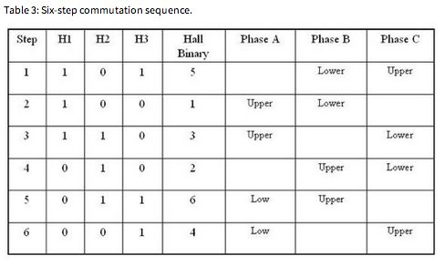
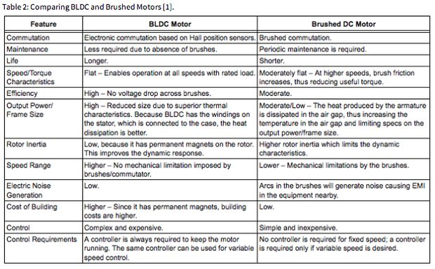

直流无刷电机的控制需要一个电子控制电路。为了驱动直流无刷电机运动，定子线圈必须根据转子的位置按设定好的序列依次通电。转子位置通过嵌入在定子的霍尔效应传感器获得。图3展示了无刷直流电机控制序列的控制框图。
嵌入在定子并与定子线圈在一条线上的霍尔传感器，提供了与接近霍尔传感器的转子磁极是北极或南极一致的数字输出信号。根据这一数字输出信号，微控制器可以切换电机驱动电路的序列，依次给相应的定子线圈通电。每一次驱动序列的切换都有一相线圈通正电压，一相线圈通负电压，一相线圈不通电。驱动序列的切换分为六拍，由霍尔传感器的输出决定哪一相绕组需要通电。表格3给出了电机顺时针旋转驱动序列切换的例子。
##步骤四：机械设计
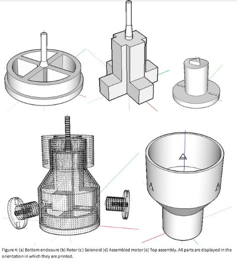

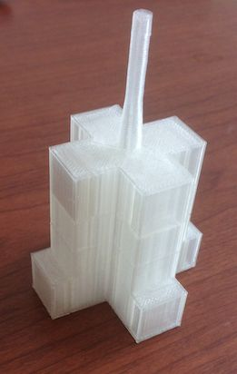
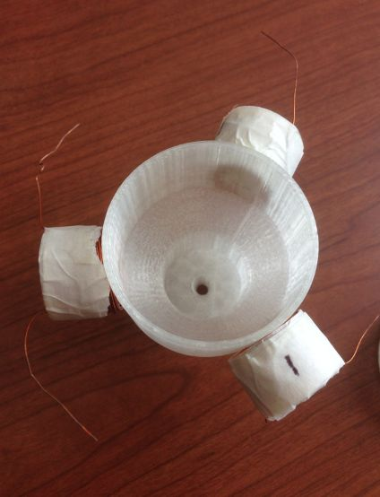

最终的机械设计包含4个分组件；底部端盖，转子，顶部端盖，定子线圈骨架，如图4所示。
图4中，(a)底部端盖；(b)转子；(c)定子线圈骨架；(d)安装后的电机;(e)顶部安装。所有展示的部分的方向都与其打印的方向相同。图4(b)中的底部端盖包含8个永磁体，4个用于驱动电机另外4个用于给霍尔传感器提供位置信息。如图4(d)所示转子通过滑动轴承安入底部端盖。
如图4(e)所示的顶部端盖包裹住转子并与底部端盖吻合一起包裹住整个电机。顶部端盖包含3个霍尔传感器和3个三角形切口用于接入定子线圈。
图4(c)所示定子包含三角形的切口使得定子线圈在一个水平线上，并且和转子磁极垂直。
##步骤五：打印

之前描述的所有部件都由Makerbot Replicator 2打印。所有部分可以被一次打印出来，并且打印参数在很大范围内变化时仍能得到满意的效果。最终打印的产品使用20%浓度的PLA塑料并且每层厚度在0.2mm。
通过试验和误差修正，底部和顶部端盖在每面增加0.25mm后能偶很好的组装起来，转子与其他各面间隙0.4mm空间后可以自由转动。
通过正确设计机械结构内部空间，磁极和霍尔传感器可以被安装在合适的地方，在打印到安装空间底部是可以暂停打印，然后将磁极和霍尔传感器安装进去后再继续打印。合适的暂停高度在表格4中给出。
3D打印的部件可以被拿出3D打印机，去除掉多余的塑料后就能够被安装在一起。被打印的部件应该轻而易举的被组装在一起。
线圈螺线管需要后加工处理，每一个螺线管需要缠绕400圈26AWG的漆包线。可以通过绕线机来完成这一工作。确保每个螺线管漆包线的缠绕方向一致，这样才能产生同一方向的磁极。螺线管线圈缠好后就可以安装在顶部端盖内了。可以通过强力胶来加强粘结力。
##步骤六：电路
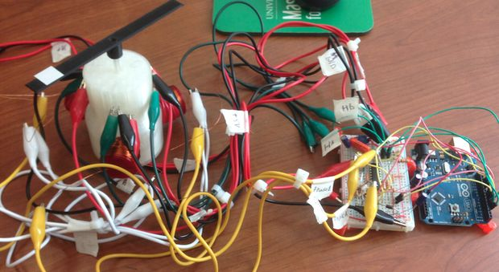
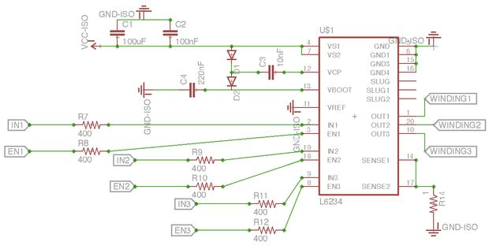
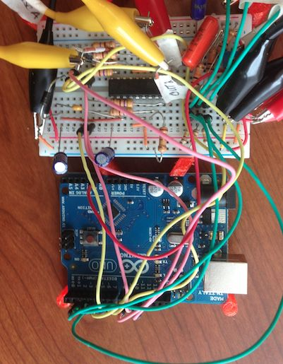
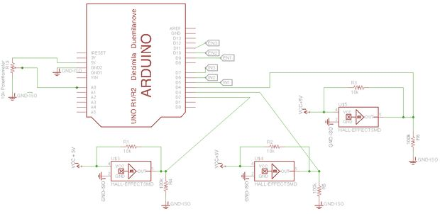

电子元器件按照上图连在一起。与L6234电机驱动芯片相连的VCC的电压范围可为7V~42V之间的任意值，但是我建议这一电压小于12V。
##步骤七：控制软件
通过Arduino来控制的驱动序列切换程序可以在以下地址获得。
>(https://github.com/pi-track/3Dmotor)
##步骤八：进一步的工作

下一阶段的工作可以分为4个主要部分；机械结构优化，效率提升，控制性能的提升和实际应用。下一步工作的基础是测试相对于电机电流的转矩-速度特性和效率特性测试。
控制性能的提升最好通过硬件的方法而不是通过软件，这样能够极大的减少以后应用的成本和电机的尺寸。以下链接中介绍了其中的一个简单应用。
>(http://www.instructables.com/id/BLDC-Motor-Control-with-Arduino-salvaged-HD-motor/step12/An-Alternate-Hardware-Based-Approach-to-Commutatio/)

电机机械结构的设计中包含了很多可以优化的部分。螺线管可以被优化设计使之更容易装入电机内部。电机能够显著的减小设计尺寸。位置磁极能够减小尺寸来降低转子的时间常数。通过打印一系列不同尺寸的电机，可以指导电机的参数化设计。
电机的效率可以通过检验在一定输入电压范围内转矩-速度特性来优化。
如果一个完全优化的3D打印电机能够利用参数化设计，并且打印出不同的尺寸和等级的产品，那么这将拥有广阔的应用前景。
##步骤九：资料/进一步阅读材料
这里是我做这个项目搜集整理的一些资料。
一些有用的资源：
[1] Brushless DC Motor Fundamentals - Padmaraja Yedamale - http://electrathonoftampabay.org/www/Documents/Mo...

[2] Understanding DC Motors - http://www.me.umn.edu/courses/me2011/arduino/tech...

[3] http://www.me.umn.edu/courses/me2011/arduino/tech...

[4] http://www.me.umn.edu/courses/me2011/arduino/tech...

